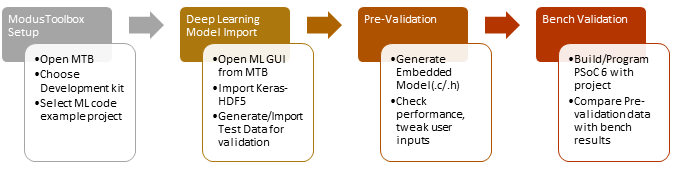
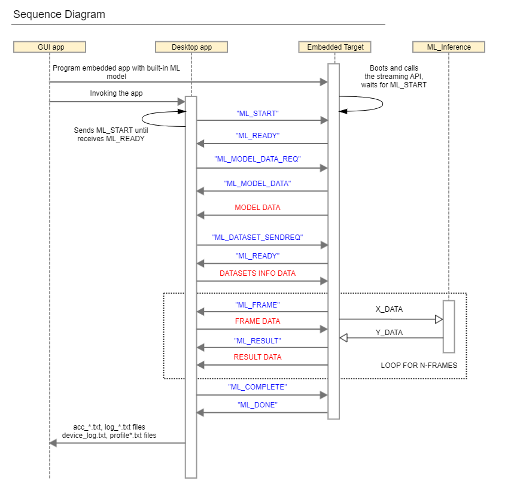

# Machine learning: Neural network profiler

This code example demonstrates how to run through the ModusToolbox&trade; machine learning (ModusToolbox&trade;-ML) development flow with PSoC&trade; 6 MCU, where the end user has a pre-trained neural network (NN) model, which can be profiled and validated at the PC and target device.

You can import a pre-trained model using the ModusToolbox&trade;-ML configurator tool, create an embedded, optimized version of this model, and validate the performance on the PC. After this, the validation data files can be integrated to this code example or streamed to the device (default option), so you can run the same validation data as well as profile performance when the ML model is deployed to the PSoC&trade; 6 MCU.

**Figure 1. ModusToolbox&trade;-ML development flow**



For details about the ModusToolbox&trade; machine learning solution, see this [link](https://www.cypress.com/products/modustoolbox/machine-learning).

[View this README on GitHub.](https://github.com/Infineon/mtb-example-ml-profiler)

[Provide feedback on this code example.](https://cypress.co1.qualtrics.com/jfe/form/SV_1NTns53sK2yiljn?Q_EED=eyJVbmlxdWUgRG9jIElkIjoiQ0UyMzI1NTEiLCJTcGVjIE51bWJlciI6IjAwMi0zMjU1MSIsIkRvYyBUaXRsZSI6Ik1hY2hpbmUgbGVhcm5pbmc6IE5ldXJhbCBuZXR3b3JrIHByb2ZpbGVyIiwicmlkIjoicmxvcyIsIkRvYyB2ZXJzaW9uIjoiMi4wLjAiLCJEb2MgTGFuZ3VhZ2UiOiJFbmdsaXNoIiwiRG9jIERpdmlzaW9uIjoiTUNEIiwiRG9jIEJVIjoiSUNXIiwiRG9jIEZhbWlseSI6IlBTT0MifQ==)


## Requirements

- [ModusToolbox&trade; software](https://www.cypress.com/products/modustoolbox-software-environment) v2.4
- Board support package (BSP) minimum required version: 2.0.0
- Programming language: C
- Associated parts: All [PSoC&trade; 6 MCU](http://www.cypress.com/PSoC6) parts


## Supported toolchains (make variable 'TOOLCHAIN')

- GNU Arm® embedded compiler v10.3.1 (`GCC_ARM`) - Default value of `TOOLCHAIN`
- Arm&reg; compiler v6.13 (`ARM`)
- IAR C/C++ compiler v8.42.2 (`IAR`)


## Supported kits (make variable 'TARGET')

- [PSoC&trade; 6 Wi-Fi Bluetooth&reg; prototyping kit](https://www.cypress.com/CY8CPROTO-062-4343W) (`CY8CPROTO-062-4343W`) - Default value of `TARGET`
- [PSoC&trade; 6 Wi-Fi Bluetooth&reg; pioneer kit](https://www.cypress.com/CY8CKIT-062-WiFi-BT) (`CY8CKIT-062-WIFI-BT`)
- [PSoC&trade; 62S2 Wi-Fi Bluetooth&reg; pioneer kit](https://www.cypress.com/CY8CKIT-062S2-43012) (`CY8CKIT-062S2-43012`)
- [PSoC&trade; 62S1 Wi-Fi Bluetooth&reg; pioneer kit](https://www.cypress.com/CYW9P62S1-43438EVB-01) (`CYW9P62S1-43438EVB-01`)
- [PSoC&trade; 62S1 Wi-Fi Bluetooth&reg; pioneer kit](https://www.cypress.com/CYW9P62S1-43012EVB-01) (`CYW9P62S1-43012EVB-01`)
- [PSoC&trade; 62S3 Wi-Fi Bluetooth&reg; prototyping kit](https://www.cypress.com/CY8CPROTO-062S3-4343W) (`CY8CPROTO-062S3-4343W`)
- [PSoC&trade; 64 "Secure Boot" Wi-Fi Bluetooth&reg; pioneer kit](http://www.cypress.com/CY8CKIT-064B0S2-4343W) (`CY8CKIT-064B0S2-4343W`)


## Hardware setup

This example uses the board's default configuration. See the kit user guide to ensure that the board is configured correctly.

**Note:** The PSoC&trade; 6 Bluetooth&reg; LE pioneer kit (CY8CKIT-062-BLE) and the PSoC&trade; 6 Wi-Fi Bluetooth&reg; pioneer kit (CY8CKIT-062-WIFI-BT) ship with KitProg2 installed. The ModusToolbox&trade; software requires KitProg3. Before using this code example, make sure that the board is upgraded to KitProg3. The tool and instructions are available in the [Firmware Loader](https://github.com/Infineon/Firmware-loader) GitHub repository. If you do not upgrade, you will see an error like "unable to find CMSIS-DAP device" or "KitProg firmware is out of date".


## Software setup

Install a terminal emulator if you don't have one. Instructions in this document use [Tera Term](https://ttssh2.osdn.jp/index.html.en).

Use the ModusToolbox&trade;-ML configurator tool (from *{ModusToolbox&trade; software install directory}/tools_{version}/ml-configurator/*) to load a pre-trained NN model and generate C files to be used with this code example. Alternatively, you can launch the configurator tool in Eclipse IDE for ModusToolbox&trade; from the Quick Launch window. For more information, see the [*ModusToolbox&trade; machine learning user guide*](https://www.cypress.com/ModusToolboxMLUserGuide). 

By default, the Makefile uses a model that comes with the code example. The pre-trained NN model is located in the *pretrained_models* folder. You can use the ModusToolbox&trade;-ML configurator to link to this file, or load another model file and generate C files for the target device.

By default, the output files location is set to *mtb_ml_gen*. The project name is set to *TEST_MODEL*. If you change any of these default settings, edit the following Makefile parameters of this code example:

| Makefile parameter | Description |
| :--------   | :-------- |
| `NN_TYPE=`  | Defines the NN weights and input data format. It can be float, int16x16, int16x8, or int8x8. |
| `NN_MODEL_NAME=` | Defines the name of the model. The name comes from the *project name* defined in the ML configurator tool. |
| `NN_MODEL_FOLDER=` | Sets the name where the model files will be placed. The name comes from the *output file location* defined in the ModusToolbox&trade;-ML configurator tool. |

<br>

To validate the given model with the ModusToolbox&trade;-ML configurator tool, click the **Validate in Desktop** button. By default, the project uses testing data stored in the file located at *test_data/test_data.csv*.

Alternatively, you can use a random dataset structure to validate the model. You can click the **Validate** button to initiate the validation. Note that this will generate the regression data files, which can be stored in the internal memory of the target device. Because of that, limit the sample count to 100 in the ModusToolbox&trade;-ML configurator tool.

You can also stream the test data to the device by clicking the **Validate on Target**. In this scheme, the regression data files are not stored in the internal memory, so you can work with a larger dataset. It uses the UART to stream the data.

This code example sets the UART baudrate based on the operating system used to build the firmware. It sets to 115.2 Kbps for MacOS and 1 Mbps for Windows or Linux. ModusToolbox&trade;-ML configurator tool also sets the baudrate based on the operating system. If the code example is built on a different operating system then the one running the tool, check if the baudrate matches. If not, rebuild the firmware by setting the appropriate value in the *main.c* when calling *cy_retarget_io_init()*;

## Using the code example

Create the project and open it using one of the following:

<details><summary><b>In Eclipse IDE for ModusToolbox&trade; software</b></summary>

1. Click the **New Application** link in the **Quick Panel** (or, use **File** > **New** > **ModusToolbox Application**). This launches the [Project Creator](https://www.cypress.com/ModusToolboxProjectCreator) tool.

2. Pick a kit supported by the code example from the list shown in the **Project Creator - Choose Board Support Package (BSP)** dialog.

   When you select a supported kit, the example is reconfigured automatically to work with the kit. To work with a different supported kit later, use the [Library Manager](https://www.cypress.com/ModusToolboxLibraryManager) to choose the BSP for the supported kit. You can use the Library Manager to select or update the BSP and firmware libraries used in this application. To access the Library Manager, click the link from the **Quick Panel**.

   You can also just start the application creation process again and select a different kit.

   If you want to use the application for a kit not listed here, you may need to update the source files. If the kit does not have the required resources, the application may not work.

3. In the **Project Creator - Select Application** dialog, choose the example by enabling the checkbox.

4. (Optional) Change the suggested **New Application Name**.

5. The **Application(s) Root Path** defaults to the Eclipse workspace which is usually the desired location for the application. If you want to store the application in a different location, you can change the *Application(s) Root Path* value. Applications that share libraries should be in the same root path.

6. Click **Create** to complete the application creation process.

For more details, see the [Eclipse IDE for ModusToolbox&trade; software user guide](https://www.cypress.com/MTBEclipseIDEUserGuide) (locally available at *{ModusToolbox&trade; software install directory}/ide_{version}/docs/mt_ide_user_guide.pdf*).

</details>

<details><summary><b>In command-line interface (CLI)</b></summary>

ModusToolbox&trade; software provides the Project Creator as both a GUI tool and the command line tool, "project-creator-cli". The CLI tool can be used to create applications from a CLI terminal or from within batch files or shell scripts. This tool is available in the *{ModusToolbox&trade; software install directory}/tools_{version}/project-creator/* directory.

Use a CLI terminal to invoke the "project-creator-cli" tool. On Windows, use the command line "modus-shell" program provided in the ModusToolbox&trade; software installation instead of a standard Windows command-line application. This shell provides access to all ModusToolbox&trade; software tools. You can access it by typing `modus-shell` in the search box in the Windows menu. In Linux and macOS, you can use any terminal application.

This tool has the following arguments:

Argument | Description | Required/optional
---------|-------------|-----------
`--board-id` | Defined in the `<id>` field of the [BSP](https://github.com/Infineon?q=bsp-manifest&type=&language=&sort=) manifest | Required
`--app-id`   | Defined in the `<id>` field of the [CE](https://github.com/Infineon?q=ce-manifest&type=&language=&sort=) manifest | Required
`--target-dir`| Specify the directory in which the application is to be created if you prefer not to use the default current working directory | Optional
`--user-app-name`| Specify the name of the application if you prefer to have a name other than the example's default name | Optional

<br>

The following example will clone the "[Hello World](https://github.com/Infineon/mtb-example-psoc6-hello-world)" application with the desired name "MyHelloWorld" configured for the *CY8CKIT-062-WIFI-BT* BSP into the specified working directory, *C:/mtb_projects*:

   ```
   project-creator-cli --board-id CY8CKIT-062-WIFI-BT --app-id mtb-example-psoc6-hello-world --user-app-name MyHelloWorld --target-dir "C:/mtb_projects"
   ```

**Note:** The project-creator-cli tool uses the `git clone` and `make getlibs` commands to fetch the repository and import the required libraries. For details, see the "Project creator tools" section of the [ModusToolbox&trade; software user guide](https://www.cypress.com/ModusToolboxUserGuide) (locally available at *{ModusToolbox&trade; software install directory}/docs_{version}/mtb_user_guide.pdf*).

</details>

<details><summary><b>In third-party IDEs</b></summary>

Use one of the following options:

- **Use the standalone [Project Creator](https://www.cypress.com/ModusToolboxProjectCreator) tool:**

   1. Launch Project Creator from the Windows Start menu or from *{ModusToolbox&trade; software install directory}/tools_{version}/project-creator/project-creator.exe*.

   2. In the initial **Choose Board Support Package** screen, select the BSP, and click **Next**.

   3. In the **Select Application** screen, select the appropriate IDE from the **Target IDE** drop-down menu.

   4. Click **Create** and follow the instructions printed in the bottom pane to import or open the exported project in the respective IDE.

<br>

- **Use command-line interface (CLI):**

   1. Follow the instructions from the **In command-line interface (CLI)** section to create the application, and then import the libraries using the `make getlibs` command.

   2. Export the application to a supported IDE using the `make <ide>` command.

   3. Follow the instructions displayed in the terminal to create or import the application as an IDE project.

For a list of supported IDEs and more details, see the "Exporting to IDEs" section of the [ModusToolbox&trade; software user guide](https://www.cypress.com/ModusToolboxUserGuide) (locally available at *{ModusToolbox&trade; software install directory}/docs_{version}/mtb_user_guide.pdf*).

</details>


## Operation

If using a PSoC&trade; 64 "Secure" MCU kit (like CY8CKIT-064B0S2-4343W), the PSoC&trade; 64 device must be provisioned with keys and policies before being programmed. Follow the instructions in the ["Secure Boot" SDK user guide](https://www.cypress.com/documentation/software-and-drivers/psoc-64-secure-mcu-secure-boot-sdk-user-guide) to provision the device. If the kit is already provisioned, copy-paste the keys and policy folder to the application folder.

1. Connect the board to your PC using the provided USB cable through the KitProg3 USB connector.

2. If using local regression data, in *main.c*, set the `REGRESSION_DATA_SOURCE` to `USE_LOCAL_DATA`. Then open a terminal program and select the KitProg3 COM port. Set the serial port parameters to 8N1 and 115200 baud.

3. Program the board using one of the following:

   <details><summary><b>Using Eclipse IDE for ModusToolbox&trade; software</b></summary>

      1. Select the application project in the Project Explorer.

      2. In the **Quick Panel**, scroll down, and click **\<Application Name> Program (KitProg3_MiniProg4)**.
   </details>

   <details><summary><b>Using CLI</b></summary>

     From the terminal, execute the `make program` command to build and program the application using the default toolchain to the default target. The default toolchain and target are specified in the application's Makefile but you can override those values manually:
      ```
      make program TARGET=<BSP> TOOLCHAIN=<toolchain>
      ```

      Example:
      ```
      make program TARGET=CY8CPROTO-062-4343W TOOLCHAIN=GCC_ARM
      ```
   </details>

4. After programming, the application starts automatically. If using regression local data, confirm that "Neural Network Profiler", model information, profiling data and accuracy results are printed on the UART terminal.

5. If using streaming regression data (default option), open the ModusToolbox&trade;-ML configurator tool. Open the *design.mtbml* file and click **Validate on Target**. Select the KitProg COM port (ensure that no other software has the COM port open) and check the *Quantization* that matches the **NN_TYPE** set in the Makefile. Click **Validate**.

5. If using the ModusToolbox&trade;-ML configurator tool, the results of the validation are printed on the tool's console. Log files for the profiling are stored in the following files:

   - *profiler_frame_log.txt*: Per-frame profile information
   - *profiler_info_log.txt*: Per-model profile information
   - *profiler_output_log.txt*: Per-frame output log

   You can choose the type of profiling/debugging data to be printed by setting the `PROFILE_CONFIGURATION` macro in *main.c*.

   **Note:** Depending on the chosen quantization, validation results might return a failure if the accuracy is not greater than or equal to 98%.


## Debugging

You can debug the example to step through the code. In the IDE, use the **\<Application Name> Debug (KitProg3_MiniProg4)** configuration in the **Quick Panel**. For details, see the "Program and debug" section in the [Eclipse IDE for ModusToolbox&trade; software user guide](https://www.cypress.com/MTBEclipseIDEUserGuide).

**Note:** **(Only while debugging)** On the CM4 CPU, some code in `main()` may execute before the debugger halts at the beginning of `main()`. This means that some code executes twice – once before the debugger stops execution, and again after the debugger resets the program counter to the beginning of `main()`. See [KBA231071](https://community.cypress.com/docs/DOC-21143) to learn about this and for the workaround.


## Design and implementation

In this example, you must provide a pre-trained NN model with the weights, regression data, and the model parameters. The ModusToolbox&trade;-ML configurator tool can generate such data based on the standard Keras H5 format. By default, these files are located in the *./mtb_ml_gen* folder. The code examples also provides an ModusToolbox&trade;-ML configurator tool project file - *design.mtbml*, which points to the pre-trained NN model available in the *pretrained_models* folder.

If you change the output file location in the ModusToolbox&trade;-ML configurator tool, you must also reflect the change in the Makefile (the `NN_MODEL_FOLDER` parameter). The model data is stored as a header file or as a binary file (used for filesystem applications). This example uses header files. Depending the type of the NN model chosen in the Makefile (the `NN_TYPE` parameter), the application uses the files and variables from the table below (*KEY* is the output file prefix defined by the ModusToolbox&trade;-ML configurator tool):

**NN Type: float**

| Folder name | File name | Variable name | Description |
| :--------   | :-------- | :------------- | :------------ |
| *mtb_ml_models* | *KEY_model_all.h* | `KEY_model_flt_bin` | Contains the NN weights in float |
| *mtb_ml_regression_data* | *KEY_x_data_flt.h*<br>*KEY_y_data_flt.h* |  `KEY_x_data_flt_bin`<br>`KEY_y_data_flt_bin` | Contains the input (x) and output (y) regression data in float |

<br>

**NN Type: int16x16**

| Folder name | File name | Variable name | Description |
| :--------   | :-------- | :------------- | :------------ |
| *mtb_ml_models* | *KEY_model_all.h* | `KEY_model_fixed16_bin` | Contains the NN weights in 16-bit format |
| *mtb_ml_regression_data* | *KEY_x_data_fixed.h*<br>*KEY_y_data_fixed.h* | `KEY_x_data_fixed16_bin`<br>`KEY_y_data_fixed_bin` | Contains the input (x) and output (y) regression data in 16-bit format |

<br>

**NN Type: int16x8**

| Folder name | File name | Variable name | Description |
| :--------   | :-------- | :------------- | :------------ |
| *mtb_ml_models* | *KEY_model_all.h* | `KEY_model_fixed8_bin` | Contains the NN weights in 8-bit format |
| *mtb_ml_regression_data* | *KEY_x_data_fixed.h*<br>*KEY_y_data_fixed.h* | `KEY_x_data_fixed16_bin`<br>`KEY_y_data_fixed_bin` | Contains the input (x) and output (y) regression data in 16-bit format |


<br>

**NN Type: int8x8**

| Folder name | File name | Variable name |  Description |
| :--------   | :-------- | :------------- | :------------ |
| *mtb_ml_models* | *KEY_model_all.h* | `KEY_model_fixed8_bin` | Contains the NN weights in 8-bit format |
| *mtb_ml_regression_data* | *KEY_x_data_fixed.h*<br>*KEY_y_data_fixed.h* | `KEY_x_data_fixed8_bin`<br>`KEY_y_data_fixed_bin` | Contains the input (x) regression data in 8-bit format and output (y) regression data in 8-bit format |


<br>

Note that the model parameter file is located in *mtb_ml_models/KEY_model_all.h* and the variable name is `KEY_model_prms_bin` for all NN types. Set the `NN_MODEL_NAME` parameter in the Makefile based on the output file prefix chosen in the ModusToolbox&trade;-ML configurator tool.

After updating the Makefile, all the model files are built into the application automatically, allowing the NN inference engine to be initialized and fed with the regression data.

This application has an option to choose the source of the regression data in the *main.c* file. You can set the `REGRESSION_DATA_SOURCE` to one of the following:
   - `USE_STREAM_DATA` – Uses the ModusToolbox&trade;-ML Configurator tool to stream the regression data
   - `USE_LOCAL_DATA` – Uses the files located in *mtb_ml_gen/mtb_ml_regression_data* for the regression data

The application also has an option to choose what type of profiling/debugging data to print/stream. You can set the `PROFILE_CONFIGURATION` to one of the following:

   - `CY_ML_PROFILE_DISABLE` – Disable profiling
   - `CY_ML_PROFILE_ENABLE_MODEL` (default) - Enables model profiling
   - `CY_ML_PROFILE_ENABLE_LAYER` – Enables per-layer profiling
   - `CY_ML_PROFILE_ENABLE_MODEL_PER_FRAME` – Enables per-frame model profiling
   - `CY_ML_PROFILE_ENABLE_LAYER_PER_FRAME` – Enables per-frame layer profiling
   - `CY_ML_LOG_ENABLE_MODEL_LOG` – Enables model output


If using the local regression data, the application automatically loads the regression data generated by the ML configurator tool. The regression data consists of a collection of inputs (X) and a collection of outputs (Y). Once the inference engine processes X, it outputs the result. Then the firmware compares the result with the desired value, Y. If these match, the firmware contributes to the accuracy calculation.

If using the ModusToolbox&trade;-ML configurator tool, the same regression data is streamed over the UART. The figure below shows the communication sequence diagram between the tool and the device.

**Figure 2. Communication sequence diagram**




### Files and folders

```
|-- mtb_ml_gen/               # Contains the model and regression files
|-- pretrained_models/        # Contains the H5 format model (used by the ML configurator tool)
|-- test_data/                # Contains a CSV file with the test data
|-- source                    # Contains the source code files for this example
   |- elapsed_timer.c/h       # Implements a system tick timer
   |- ml_local_regression.c/h # Implements a local regression flow
|-- design.mtbml              # ModusToolbox&trade;-ML configurator tool project file
```

### Resources and settings

**Table 1. Application resources**

| Resource  |  Alias/object     |    Purpose     |
| :------- | :------------    | :------------ |
| UART (HAL)|cy_retarget_io_uart_obj| UART HAL object used by Retarget-IO for Debug UART port  |

<br>

## Related resources

Resources | Links
----------|------
Application notes | [AN228571](https://www.cypress.com/AN228571) – Getting started with PSoC&trade; 6 MCU on ModusToolbox&trade; software <br> [AN221774](https://www.cypress.com/AN221774) – Getting started with PSoC&trade; 6 MCU on PSoC&trade; Creator <br> [AN210781](https://www.cypress.com/AN210781) – Getting started with PSoC&trade; 6 MCU with Bluetooth&reg; Low Energy connectivity on PSoC&trade; Creator <br> [AN215656](https://www.cypress.com/AN215656) – PSoC&trade; 6 MCU: Dual-CPU system design
Code examples | [Using ModusToolbox&trade; software](https://github.com/infineon/Code-Examples-for-ModusToolbox-Software) on GitHub
Device documentation |[PSoC&trade; 6 MCU datasheets](https://www.cypress.com/search/all?f[0]=meta_type%3Atechnical_documents&f[1]=resource_meta_type%3A575&f[2]=field_related_products%3A114026) <br>[PSoC&trade; 6 technical reference manuals](https://www.cypress.com/search/all/PSoC%206%20Technical%20Reference%20Manual?f[0]=meta_type%3Atechnical_documents&f[1]=resource_meta_type%3A583)
Development kits | Visit www.cypress.com/microcontrollers-mcus-kits and use the options in the **Select your kit** section to filter kits by *Product family* or *Features*.
Libraries on GitHub | [mtb-pdl-cat1](https://github.com/infineon/mtb-pdl-cat1) – PSoC&trade; 6 peripheral driver library (PDL) and docs <br> [mtb-hal-cat1](https://github.com/infineon/mtb-hal-cat1) – Hardware abstraction layer (HAL) Library and docs <br> [retarget-io](https://github.com/infineon/retarget-io) – Utility library to retarget STDIO messages to a UART port
Middleware on GitHub | [capsense](https://github.com/infineon/capsense) – CAPSENSE&trade; library and docs <br> [psoc6-middleware](https://github.com/infineon/psoc6-middleware) – Links to all PSoC&trade; 6 MCU middleware
Tools  | [Eclipse IDE for ModusToolbox&trade; software](https://www.cypress.com/modustoolbox) – ModusToolbox&trade; software is a collection of easy-to-use software and tools enabling rapid development with Infineon MCUs, covering applications from embedded sense and control to wireless and cloud-connected systems using AIROC&trade; Wi-Fi and Bluetooth® connectivity devices.
<br>

## Other resources

Cypress provides a wealth of data at www.cypress.com to help you select the right device, and quickly and effectively integrate it into your design.

For PSoC&trade; 6 MCU devices, see [How to design with PSoC&trade; 6 MCU - KBA223067](https://community.cypress.com/docs/DOC-14644) in the Cypress community.

## Document history

Document title: *CE232551* - *Machine learning: Neural network profiler*

| Version | Description of change |
| ------- | --------------------- |
| 1.0.0   | New code example      |
| 1.1.0   | Added test_data.csv file for regression |
| 2.0.0   | Updated code to use ml-middleware library <br> Added regression data streaming capability


<br>

All other trademarks or registered trademarks referenced herein are the property of their respective owners.

---------

© Cypress Semiconductor Corporation, 2020-2021. This document is the property of Cypress Semiconductor Corporation, an Infineon Technologies company, and its affiliates ("Cypress").  This document, including any software or firmware included or referenced in this document ("Software"), is owned by Cypress under the intellectual property laws and treaties of the United States and other countries worldwide.  Cypress reserves all rights under such laws and treaties and does not, except as specifically stated in this paragraph, grant any license under its patents, copyrights, trademarks, or other intellectual property rights.  If the Software is not accompanied by a license agreement and you do not otherwise have a written agreement with Cypress governing the use of the Software, then Cypress hereby grants you a personal, non-exclusive, nontransferable license (without the right to sublicense) (1) under its copyright rights in the Software (a) for Software provided in source code form, to modify and reproduce the Software solely for use with Cypress hardware products, only internally within your organization, and (b) to distribute the Software in binary code form externally to end users (either directly or indirectly through resellers and distributors), solely for use on Cypress hardware product units, and (2) under those claims of Cypress’s patents that are infringed by the Software (as provided by Cypress, unmodified) to make, use, distribute, and import the Software solely for use with Cypress hardware products.  Any other use, reproduction, modification, translation, or compilation of the Software is prohibited.
<br>
TO THE EXTENT PERMITTED BY APPLICABLE LAW, CYPRESS MAKES NO WARRANTY OF ANY KIND, EXPRESS OR IMPLIED, WITH REGARD TO THIS DOCUMENT OR ANY SOFTWARE OR ACCOMPANYING HARDWARE, INCLUDING, BUT NOT LIMITED TO, THE IMPLIED WARRANTIES OF MERCHANTABILITY AND FITNESS FOR A PARTICULAR PURPOSE.  No computing device can be absolutely secure.  Therefore, despite security measures implemented in Cypress hardware or software products, Cypress shall have no liability arising out of any security breach, such as unauthorized access to or use of a Cypress product.  CYPRESS DOES NOT REPRESENT, WARRANT, OR GUARANTEE THAT CYPRESS PRODUCTS, OR SYSTEMS CREATED USING CYPRESS PRODUCTS, WILL BE FREE FROM CORRUPTION, ATTACK, VIRUSES, INTERFERENCE, HACKING, DATA LOSS OR THEFT, OR OTHER SECURITY INTRUSION (collectively, "Security Breach").  Cypress disclaims any liability relating to any Security Breach, and you shall and hereby do release Cypress from any claim, damage, or other liability arising from any Security Breach.  In addition, the products described in these materials may contain design defects or errors known as errata which may cause the product to deviate from published specifications.  To the extent permitted by applicable law, Cypress reserves the right to make changes to this document without further notice. Cypress does not assume any liability arising out of the application or use of any product or circuit described in this document.  Any information provided in this document, including any sample design information or programming code, is provided only for reference purposes.  It is the responsibility of the user of this document to properly design, program, and test the functionality and safety of any application made of this information and any resulting product.  "High-Risk Device" means any device or system whose failure could cause personal injury, death, or property damage.  Examples of High-Risk Devices are weapons, nuclear installations, surgical implants, and other medical devices.  "Critical Component" means any component of a High-Risk Device whose failure to perform can be reasonably expected to cause, directly or indirectly, the failure of the High-Risk Device, or to affect its safety or effectiveness.  Cypress is not liable, in whole or in part, and you shall and hereby do release Cypress from any claim, damage, or other liability arising from any use of a Cypress product as a Critical Component in a High-Risk Device.  You shall indemnify and hold Cypress, including its affiliates, and its directors, officers, employees, agents, distributors, and assigns harmless from and against all claims, costs, damages, and expenses, arising out of any claim, including claims for product liability, personal injury or death, or property damage arising from any use of a Cypress product as a Critical Component in a High-Risk Device.  Cypress products are not intended or authorized for use as a Critical Component in any High-Risk Device except to the limited extent that (i) Cypress’s published data sheet for the product explicitly states Cypress has qualified the product for use in a specific High-Risk Device, or (ii) Cypress has given you advance written authorization to use the product as a Critical Component in the specific High-Risk Device and you have signed a separate indemnification agreement.
<br>
Cypress, the Cypress logo, and combinations thereof, WICED, ModusToolBox, PSoC, CapSense, EZ-USB, F-RAM, and Traveo are trademarks or registered trademarks of Cypress or a subsidiary of Cypress in the United States or in other countries.  For a more complete list of Cypress trademarks, visit cypress.com.  Other names and brands may be claimed as property of their respective owners.
